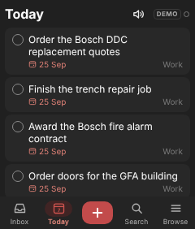
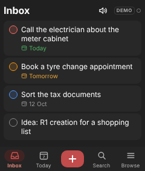
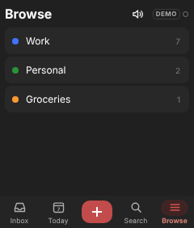
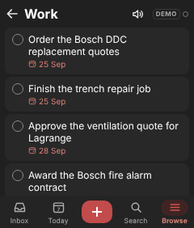
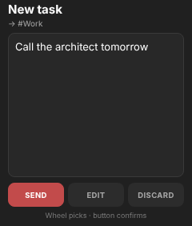
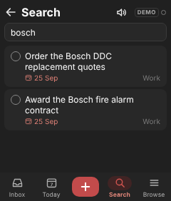
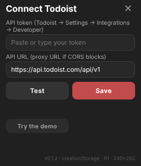

# Todoist for the Rabbit R1

[Deutsch](README.de.md) · **English**

A creation for the Rabbit R1 (240×282 px screen) that syncs directly with your own Todoist account.
It looks like the Todoist Android app in dark mode. One file, no build step, no server of yours
needed: the app talks to the Todoist API straight from the R1.

Anyone with a Todoist account can use it. Your API token is typed in on your own R1 and stays there.
It is never part of the code, the QR code or any URL, and nothing is stored on a server.

## Screenshots

From the test harness (Chromium, 240×282 px, demo data). On the R1 the system bar (back, clock,
battery) sits above the page.

| Today | Inbox | Browse | Project "Work" |
| --- | --- | --- | --- |
|  |  |  |  |

| Review after dictation | Search | Setup |
| --- | --- | --- |
|  |  |  |

## Install

On the R1: creations card → "add via QR code" → scan this code.


The same code is shown on `https://luxx1993.github.io/r1-creations/todoist/en/install.html`.
It contains only `{"title":"Todoist","url":".../todoist/en/index-v0.1.3.html?v=1","description":"Todoist tasks on the R1","iconUrl":…,"themeColor":"#C24B4B"}`.

## Set up your token

1. In Todoist (web or app): Settings → Integrations → Developer → copy your API token.
2. On first launch the R1 shows the setup screen. Type the token with the R1 keyboard and tap **Test**:
   - `OK – connected, n projects` → tap **Save** (or press the side button).
   - `401 – invalid token` → check the token.
   - `Network/CORS error` → see "CORS and proxy" below.
3. To reopen setup later: hold the screen for about 1 second.
4. No token yet? **Try the demo** shows sample tasks and sends nothing anywhere.
   **Sign out (demo)** in setup deletes the token (tap twice).

The token is kept only in the R1's `creationStorage.secure` (hardware-encrypted). In a desktop browser,
where the R1 SDK is missing, it falls back to the browser's `localStorage`.

Note: the R1 keeps storage per installed URL. After installing a new version (new `index-v….html`),
enter the token once more.

## Controls

| Input | List | Review screen | Editor / setup |
| --- | --- | --- | --- |
| Scroll wheel | move the selection (lighter border); the list follows | SEND / EDIT / DISCARD | scroll the text |
| Side button | complete the selected task (in Browse: open the project) | run the selected chip (while editing: send) | save |
| Hold PTT | record a task → review (in Search: dictate a search term) | record again | – |
| Tap the circle | complete | | |
| Tap a card | first tap selects, second tap edits | | |
| Tap / hold + | type a task / dictate a task | | |
| Speaker icon | reads the first 8 tasks of the list aloud (device voice, else the R1 voice) | | |
| Tap the sync dot | sync now and show the status | | |
| Hold the screen 1 s | setup | | |

- Completing: the circle fills, the title is struck through and the card slides away. **UNDO** stays
  at the bottom for 5 seconds.
- A PTT double click arrives as two side-button presses about 50 ms apart; the app ignores the second
  one, so it never completes two tasks at once.
- New tasks use Todoist **Quick Add**: "Review offer tomorrow #Work p1" sets the date, project and
  priority like the Todoist apps. In a project view, tasks without `#Project` go into that project,
  otherwise into the Inbox. Date words are parsed in your Todoist account's language.
- Search filters all open tasks on the device (title and project name).
- No deleting in this version.
- Sync dot: green = synced, yellow = loading or items waiting (count next to it), empty circle =
  offline or demo, red = Todoist rejected a change (e.g. 401).

Desktop keyboard: hold Space = PTT, Esc = side button, ↑/↓ = scroll wheel.

## Offline queue

Every change (add, complete, undo, edit) is saved on the R1 first and shows up in the list right away,
then it is sent. Network errors are retried on launch, every 60 seconds and when the R1 comes back
online. If Todoist rejects a change (401/403/400) it stays in the queue and an error is shown; setup
has **Clear queue (n)** for hopeless cases.

## CORS and proxy

Verified on a real R1 (October 2026): the R1 webview can call `api.todoist.com` directly, so no proxy
is needed. The folder `proxy/` holds a small Vercel function as a fallback in case that changes:
deploy `proxy/` as a Vercel project, then set the API URL in setup to
`https://<project>.vercel.app/api/v1`. It forwards only the task and project endpoints with your
`Authorization` header and stores or logs nothing.

## Host your own copy

You can simply use the hosted version above. To host it yourself (e.g. on your own GitHub Pages):

1. Copy the files of this branch (`index.html`, `en/`, `icon.png`, `install.html`, `release.py`).
2. `pip install qrcode pillow`, then
   `python3 release.py --release --base https://<you>.github.io/<repo>/todoist/`
   to build the versioned files and the QR codes for your address.
3. Publish the folder over HTTPS and scan `en/qr.png` (or open `en/install.html`).

## Develop

`index.html` is the only source for both languages. All visible text lives in the `I18N` table
(`de` and `en`); the app picks English when it is served from `/en/` (or with `?lang=en`).
`en/index.html` is a byte-identical copy made by `release.py`.

```bash
python3 release.py              # sync en/index.html after every change
python3 release.py --release    # after bumping APP_VERSION: versioned files, QR codes, install pages
node test/harness.mjs           # Node 22+, Chrome/Chromium; fails if the English copy is out of sync
```

The harness drives the real page in headless Chrome against a mock Todoist API v1, with stubs for the
R1 bridges (`CreationVoiceHandler`, `PluginMessageHandler`, `creationStorage`). It runs 121 checks,
including a full English pass, and writes the screenshots above.

Todoist API used: `GET /projects`, `GET /tasks?project_id=…`, `GET /tasks/filter?query=today | overdue`,
`POST /tasks/quick`, `POST /tasks/{id}/move`, `POST /tasks/{id}/close`, `POST /tasks/{id}/reopen`,
`POST /tasks/{id}` (base `https://api.todoist.com/api/v1`, `Authorization: Bearer <token>`).

## Known limits

- Reading aloud: the app first tries the webview's own speech synthesis, which reads word for word.
  If the R1 has no voice in the app language (setup shows `TTS 0`), or it does not start within 1.5 s,
  the text goes to the R1 voice. That voice runs through the R1's built-in LLM: the prompt pins the
  wording, but the LLM may still add words. The toast says which voice was used; the screen stays the
  main output.
- If the connection drops right after a task was created, the retry can create it a second time.
- Large accounts: Search and Browse load all open tasks.

Not affiliated with Doist or Todoist. "Todoist" is a trademark of Doist.
