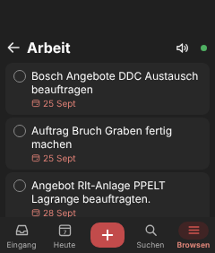
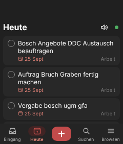
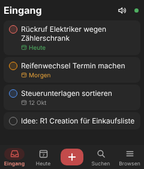
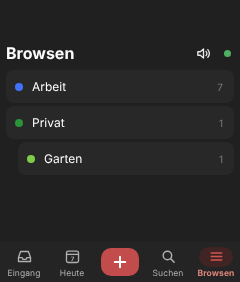
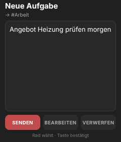
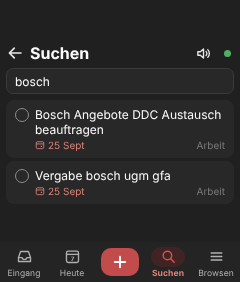
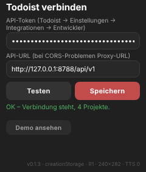
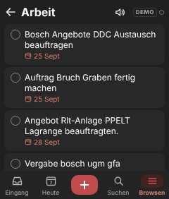

# Todoist – Aufgaben-App für den Rabbit R1

Creation für den 240×282-px-Bildschirm, die direkt mit deinem Todoist-Konto synchronisiert.
Optik nach der Todoist-Android-App im Dark Mode. Eine Datei (`index.html`), kein Build-Schritt,
kein eigener Server nötig. Referenz: `docs/r1-creations.md`. Diese Creation lebt auf dem Branch
`creation/todoist` und wird unter `/todoist/` ausgeliefert.

## Screenshots

Aus dem Test-Harness (Chromium, 240×282 px, gemockte Todoist-API). Auf dem R1 sitzt die
System-Leiste (zurück, Uhr, Akku) darüber, außerhalb der Seite.

| Projekt „Arbeit“ | Heute | Eingang | Browsen |
| --- | --- | --- | --- |
|  |  |  |  |

| Review nach Sprache | Suchen | Setup | Demo-Modus |
| --- | --- | --- | --- |
|  |  |  |  |

## Installieren

R1: Creations-Karte → „add via QR code“ → scannen.


Der QR enthält nur `{"title":"Todoist","url":".../todoist/index-v0.1.1.html?v=1","description":…,"iconUrl":…,"themeColor":"#C24B4B"}`,
niemals den Token. `install.html` zeigt denselben Code im Browser und baut ihn aus der eigenen Adresse,
funktioniert also auch auf einem anderen Host.

## Token einrichten

1. Todoist (Web oder App) → Einstellungen → Integrationen → Entwickler → API-Token kopieren.
2. Auf dem R1 öffnet sich beim ersten Start das Setup. Token eintippen (R1-Tastatur), **Testen**:
   - `OK – Verbindung steht, n Projekte` → **Speichern** (oder Side-Button).
   - `401 – Token ungültig` → Token prüfen.
   - `Netz/CORS-Fehler` → der R1-Webview darf die Todoist-API nicht direkt aufrufen, siehe „CORS und Proxy“.
3. Setup später wieder öffnen: Bildschirm ca. 1 s gedrückt halten.
4. Ohne Token: **Demo ansehen** zeigt Beispielaufgaben (aus der Designvorlage), es geht nichts ins Netz.
   „Abmelden (Demo)“ im Setup löscht den Token (zweimal tippen).

Der Token liegt nur in `creationStorage.secure` (Base64, hardwareverschlüsselt). Er steht nicht im Code,
nicht im QR, nicht in URLs und nicht in Logs; `.gitignore` blockt `.env*`, `*.secret`, `secrets.*`.
Am Desktop (ohne R1-SDK) liegt er ersatzweise im `localStorage` des Browsers.

Hinweis: `creationStorage` gehört zur installierten URL. Nach einem Update (neue `index-v….html`)
muss der Token einmal neu eingegeben werden.

## Bedienung

| Eingabe | Liste | Review-Screen | Editor / Setup |
| --- | --- | --- | --- |
| Scrollrad | Auswahl (hellerer Rand), Liste scrollt mit | SENDEN / BEARBEITEN / VERWERFEN | Text scrollen |
| Side-Button | ausgewählte Aufgabe erledigen (in Browsen: Projekt öffnen) | gewählten Chip ausführen (beim Bearbeiten: senden) | speichern |
| PTT halten | Sprachaufnahme → Review (in Suchen: Suchbegriff diktieren) | neu aufnehmen | – |
| Kreis antippen | erledigen | | |
| Karte antippen | 1. Tipp auswählen, 2. Tipp bearbeiten | | |
| Plus antippen / halten | Texteingabe / Sprachaufnahme | | |
| Lautsprecher | liest die ersten 8 Aufgaben der Liste vor | | |
| Sync-Punkt antippen | sofort synchronisieren, Status anzeigen | | |
| Bildschirm 1 s halten | Setup | | |

- Erledigen: Kreis füllt sich, Titel wird durchgestrichen, Karte gleitet hinaus. 5 s lang gibt es
  **RÜCKGÄNGIG** unten (sendet `reopen` bzw. streicht das noch wartende `close`).
- Ein PTT-Doppelklick kommt als zwei `sideClick` im Abstand von ~50 ms an. Die App ignoriert den
  zweiten, damit nie zwei Aufgaben auf einmal erledigt werden.
- Neue Aufgaben gehen per **Quick Add** an Todoist: „Angebot prüfen morgen #Arbeit p1“ setzt Datum,
  Projekt und Priorität wie in den Todoist-Apps. In einer Projektansicht landen Aufgaben ohne `#Projekt`
  in diesem Projekt (Quick Add, danach `move`), sonst im Eingang.
- Suchen filtert lokal über alle offenen Aufgaben (Titel und Projektname).
- Kein Löschen in v1.

Desktop-Tastatur: Leertaste halten = PTT, Esc = Side-Button, ↑/↓ = Scrollrad.

Sync-Punkt: grün = synchron, gelb = lädt oder Einträge warten (Zahl daneben), leerer Kreis =
offline/Demo, rot = Todoist hat abgelehnt (z. B. 401).

## Sync und Offline-Queue

- Jede Änderung (anlegen, erledigen, rückgängig, bearbeiten) wird zuerst in `creationStorage.plain`
  gespeichert und erscheint sofort in der Liste, dann gesendet.
- Netzfehler → bleibt in der Queue, neuer Versuch beim Start, alle 60 s und beim `online`-Event.
- Abgelehnt (401/403/400) → bleibt in der Queue, Fehler wird angezeigt, die Queue hält an (Reihenfolge
  bleibt erhalten). Im Setup gibt es „Warteschlange leeren (n)“ für hoffnungslose Fälle.
- 404 bei erledigen/bearbeiten (Aufgabe woanders gelöscht) → Eintrag wird verworfen.
- Quick Add + Verschieben ist zweistufig: Wurde die Aufgabe schon angelegt, wird beim nächsten Versuch
  nur noch verschoben, nicht doppelt angelegt.
- Lesen: Cache sofort anzeigen, dann beim Öffnen, beim Tab-Wechsel und alle 60 s nachladen.

Grenze: Geht die Antwort auf ein erfolgreiches Anlegen unterwegs verloren (Verbindung reißt nach dem
Senden), legt der nächste Versuch die Aufgabe ein zweites Mal an. Todoist bietet dafür `X-Request-Id`;
das ist bewusst nicht aktiv, weil ein zusätzlicher Header die CORS-Freigabe gefährden könnte.

## Todoist-API

Basis-URL `https://api.todoist.com/api/v1` (Konstante `API_BASE`, im Setup änderbar), `Authorization: Bearer <token>`.

| Zweck | Aufruf |
| --- | --- |
| Projekte, Eingang erkennen | `GET /projects` (`inbox_project`) |
| Eingang / Projekt | `GET /tasks?project_id=…` |
| Heute | `GET /tasks/filter?query=today \| overdue&lang=en` |
| Suche (alle offenen) | `GET /tasks` |
| Anlegen | `POST /tasks/quick {text}`, ggf. `POST /tasks/{id}/move {project_id}`; Fallback `POST /tasks {content}` |
| Erledigen / rückgängig | `POST /tasks/{id}/close` / `POST /tasks/{id}/reopen` |
| Bearbeiten | `POST /tasks/{id} {content}` |

Alle Listen folgen `next_cursor` (Seiten à 200). Priorität: API `4` = P1 (rot), `3` = P2 (orange),
`2` = P3 (blau), `1` = P4 (grau).

Geprüft gegen das offizielle Doist-SDK `Doist/todoist-api-typescript` (Stand 05.10.2026), weil
developer.todoist.com aus der Build-Umgebung nicht erreichbar war.

Der Zugriff ist in einer Provider-Schnittstelle gekapselt (`listInbox`, `listToday`, `listProjects`,
`listTasks(projectId)`, `listAll`, `add(text, opts)`, `complete(id)`, `reopen(id)`, `update(id, text)`,
`test()`). Es gibt `TodoistProvider` und `DemoProvider`; ein Notion-Provider müsste nur dieselben
Methoden und dasselbe Aufgabenformat liefern.

## CORS und Proxy

**Auf dem R1 geprüft (07.10.2026, v0.1.0):** Der Webview ruft `api.todoist.com` direkt auf, Lesen und
Anlegen funktionieren, kein Proxy nötig. Der Proxy bleibt als Reserve, falls Todoist das ändert.
Zeigt „Testen“ auf dem Gerät einen Netz/CORS-Fehler, obwohl der R1 online ist:

1. Den Ordner `proxy/` als eigenes Vercel-Projekt deployen (Vercel → Add New → Project → dieses Repo,
   Branch `creation/todoist`, Root Directory `proxy`).
2. Optional Env-Variable `ALLOWED_ORIGINS` (Standard `https://luxx1993.github.io`).
3. Im Setup die API-URL auf `https://<projekt>.vercel.app/api/v1` stellen, Testen, Speichern.

Der Proxy reicht nur die genutzten Task-/Projekt-Endpunkte samt `Authorization`-Header durch, speichert
und loggt nichts und braucht keinen eigenen Schlüssel.

## Deploy (GitHub Pages)

Dieser Branch wird wie alle `creation/*`-Branches vom Workflow auf `main` nach
`https://luxx1993.github.io/r1-creations/todoist/` exportiert (Push genügt).

Neue Version:

```bash
# APP_VERSION in index.html erhöhen, dann
cp index.html index-v0.1.2.html
# creation.json: "version" und "entry" anpassen, ENTRY in install.html anpassen
python3 tools/make_qr.py --title Todoist --description "Todoist-Aufgaben auf dem R1" \
  --url "https://luxx1993.github.io/r1-creations/todoist/index-v0.1.2.html?v=1" \
  --icon-url https://luxx1993.github.io/r1-creations/todoist/icon.png --theme "#C24B4B"
git commit -am "Todoist 0.1.2" && git push
```

Auf dem R1 die alte Karte deinstallieren, neuen QR scannen, Token neu eingeben.

## Testen

```bash
node test/harness.mjs      # Node 22+, Chrome/Chromium (CHROME=/pfad/zu/chrome)
```

Fährt die echte `index.html` in Headless-Chrome gegen eine gemockte Todoist-API v1 (mit absichtlich
kleinen Seiten für die Cursor-Logik) und stubbt `CreationVoiceHandler`, `PluginMessageHandler` und
`creationStorage`. 96 Prüfungen: Setup und Verbindungstest (OK, 401, CORS), Heute/Eingang/Browsen/Projekt/
Suchen, Scrollrad und Side-Button, Doppelklick-Schutz, Erledigen per Kreis und Taste mit Rückgängig,
Sprache → Review → Senden/Verwerfen, Plus tippen/halten, Bearbeiten, Vorlesen (max. 8, fester Wortlaut),
Offline-Queue über einen Neustart, abgelehnte Writes, Token nur im Secure Storage, Layout 240×282,
Layout bei 282 und 320 px Höhe, Demo-Modus, Proxy. Die Screenshots oben schreibt derselbe Lauf nach `screenshots/`.

Lokal ansehen: `python3 -m http.server 8000`, dann `http://localhost:8000/index.html` (Demo-Modus).

## Auf dem echten R1

Bestätigt (v0.1.0): Installation per QR, Token-Setup, direkter API-Zugriff ohne Proxy (CORS ok), Sync
(grüner Punkt), Anlegen, Eingang, Suchen, Layout und Farben. v0.1.1: Layout ohne Lücke oben,
Sprachaufnahme per PTT (`CreationVoiceHandler`) → Review → Senden funktioniert. Der Webview ist 240×282 px groß und liegt
*unter* der OS-Leiste; die in v0.1.0 freigehaltenen 38 px oben waren unnötig und sind in v0.1.1 weg.
Die App misst die Höhe selbst (`fitScreen()`): Meldet ein Webview mehr als 282 px, gilt der Überschuss
oben als von der Leiste verdeckt. Das Setup zeigt unten die gemessene Größe (z. B. `240×282`).

Noch offen:

- **Plus halten** als Alternative zu PTT.
- **Vorlesen**: ob das R1-LLM den Text wörtlich spricht oder ausschmückt.
- **Quick Add auf Deutsch**: ob „morgen“ erkannt wird, hängt von der Spracheinstellung des Todoist-Kontos ab.
- `creationStorage.secure` auf dem Gerät (fällt sonst auf `.plain` zurück, nie auf `localStorage`).
- `longPressEnd` und Plus-Halten mit echtem Touch, R1-Tastatur in Setup, Editor und Suchfeld.
- Tempo bei großen Konten (alle offenen Aufgaben für Suchen und Browsen).

## Dateien

| Pfad | Inhalt |
| --- | --- |
| `index.html` | die Creation (Arbeitskopie) |
| `index-v0.1.1.html` | versionierte Kopie, auf die der QR zeigt (`index-v0.1.0.html` bleibt für alte Karten) |
| `install.html` | Install-Seite mit QR |
| `qr.png`, `icon.png`, `make_icon.py` | Install-QR, Icon (96×96) und sein Generator |
| `creation.json` | Metadaten für die Übersichtsseite |
| `proxy/` | optionaler Vercel-CORS-Proxy (`api/todoist.js`, `vercel.json`) |
| `test/harness.mjs` | End-to-End-Test mit Mock-API und Screenshots |
| `screenshots/` | 240×282-Screenshots aus dem Test |
